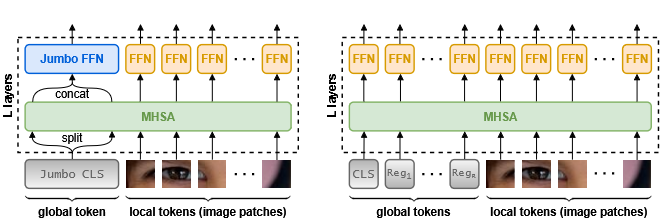

# Thicker and Quicker: A Jumbo Token for Fast Plain Vision Transformers (ICLR 2026)



**Paper:** [https://arxiv.org/abs/2502.15021](https://arxiv.org/abs/2502.15021)


**Download weights:**

```bash
wget https://huggingface.co/antofuller/jumbo/resolve/main/jumbo_pico.pth
wget https://huggingface.co/antofuller/jumbo/resolve/main/jumbo_nano.pth
wget https://huggingface.co/antofuller/jumbo/resolve/main/jumbo_tiny.pth
wget https://huggingface.co/antofuller/jumbo/resolve/main/jumbo_small.pth
wget https://huggingface.co/antofuller/jumbo/resolve/main/jumbo_base.pth
```


**Run ImageNet-1K evals, attention, and speed:**
```bash
pip install -r requirements.txt
python eval_i1k.py --model_path YOUR_PATH/jumbo_small.pth --model_size small
python measure_speed.py --model_size small
python visualize_attn.py --model_path YOUR_PATH/jumbo_small.pth --model_size small --out_dir YOUR_PATH/attn_maps --num_images 50
```

You'll get ImageNet-1K accuracies:
```
Jumbo-pico: 69.156%
Jumbo-nano: 74.528%
Jumbo-tiny: 78.366%
Jumbo-small: 82.558%
Jumbo-base: 84.954%
```

